# Project_template

Это шаблон для решения проектной работы. Структура этого файла повторяет структуру заданий. Заполняйте его по мере работы над решением.

# Задание 1. Анализ и планирование

Источник: описание компании «Тёплый дом» и монолит `apps/smart_home`. Решения As-Is: [docs/adr](docs/adr/README.md).

### 1. Описание функциональности монолитного приложения

**Управление отоплением:**

- Пользователи удалённо включают и выключают отопление в доме через веб-интерфейс.
- Система отправляет команду на реле: управление идёт **от сервера к устройству**.
- Подключение дома делает специалист. Сам пользователь датчик к системе не подключает.
- Сейчас в экосистеме только отопление. Свет, ворота и наблюдение в As-Is нет.

**Мониторинг температуры:**

- Пользователи смотрят текущую температуру в доме в том же веб-интерфейсе.
- Система сама опрашивает датчик и отдаёт последнее значение.
- В коде это реестр `sensors` и синхронный запрос в `temperature-api` при чтении датчика.
- Датчик не пушит телеметрию, истории показаний нет.

### 2. Анализ архитектуры монолитного приложения

- **Язык:** Go, HTTP-фреймворк Gin, процесс `apps/smart_home`.
- **База:** PostgreSQL, одна таблица `sensors` (`init.sql`). Драйвер `pgx`.
- **Стиль:** монолит. Обработка запросов, бизнес-логика и доступ к данным — один деплой.
- **Взаимодействие:** синхронное. Браузер → монолит → датчик/реле. Очередей и событий нет.
- **Интеграция с датчиком:** HTTP GET `/temperature?location=` и `/temperature/{sensorID}`.
- **Масштаб:** ~100 веб-клиентов и ~100 модулей отопления. Растёт только целиком.
- **Деплой:** остановка всего приложения. Отдельный релиз отопления или телеметрии невозможен.

Подробнее: [ADR-001](docs/adr/0001-as-is-monolith.md), [ADR-002](docs/adr/0002-sync-server-to-sensor.md), [ADR-003](docs/adr/0003-postgresql.md).

**Форматы данных As-Is**

Всё синхронно, без очередей. В БД — SQL-строка. С датчиком и с веб-клиентом — HTTP + JSON.

**PostgreSQL** — одна таблица `sensors` (`apps/smart_home/init.sql`). Команда on/off и сущности пользователя/дома в схеме нет.

| Колонка | Тип | Смысл |
| --- | --- | --- |
| `id` | SERIAL | идентификатор датчика |
| `name` | VARCHAR(100) | имя |
| `type` | VARCHAR(50) | сейчас только `temperature` |
| `location` | VARCHAR(100) | комната, например `Living Room` |
| `value` | FLOAT | последнее сохранённое значение, по умолчанию `0` |
| `unit` | VARCHAR(20) | например `°C` |
| `status` | VARCHAR(20) | `inactive` при создании, иначе как прислали |
| `last_updated` | TIMESTAMPTZ | время записи |
| `created_at` | TIMESTAMPTZ | время создания |

В БД уходит не «телеметрия с датчика», а то, что записал монолит через CRUD / `PATCH .../value`. `GET /sensors` подмешивает живую температуру в JSON-ответ и **в Postgres её не сохраняет**.

```json
{
  "id": 1,
  "name": "Living Room Temperature",
  "type": "temperature",
  "location": "Living Room",
  "value": 0,
  "unit": "°C",
  "status": "inactive",
  "last_updated": "2026-09-04T16:00:00Z",
  "created_at": "2026-09-04T16:00:00Z"
}
```

Запись в БД:

- `POST /api/v1/sensors` — `name`, `type`, `location`, `unit` → строка со `status=inactive`, `value=0`
- `PUT /api/v1/sensors/:id` — те же поля плюс опционально `value`, `status`
- `PATCH /api/v1/sensors/:id/value` — `{ "value": 22.5, "status": "active" }`

**Датчик** — синхронный HTTP GET, JSON. Тела запроса нет. Команды реле в коде нет.

| Куда | Как |
| --- | --- |
| по комнате | `GET {TEMPERATURE_API_URL}/temperature?location=Living%20Room` |
| по id | `GET {TEMPERATURE_API_URL}/temperature/1` |

Ответ, который ждёт монолит (`TemperatureResponse`):

```json
{
  "value": 21.4,
  "unit": "°C",
  "timestamp": "2026-09-04T16:00:00Z",
  "location": "Living Room",
  "status": "active",
  "sensor_id": "1",
  "sensor_type": "temperature",
  "description": "Living Room temperature"
}
```

Комнаты из шаблона: `1` → Living Room, `2` → Bedroom, `3` → Kitchen.

### 3. Определение доменов и границы контекстов

В коде домены не разделены: всё крутится вокруг `Sensor`. Ниже — логические bounded contexts внутри монолита. Так намечаем нарезку To-Be, не рисуя её на Context.

| Контекст | Зачем | Ubiquitous language | As-Is | Задел To-Be |
| --- | --- | --- | --- | --- |
| **Управление устройствами** | Реестр того, что стоит в доме | устройство, тип, статус, подключение | таблица `sensors`, CRUD | партнёрские приборы, self-service, комплекты |
| **Отопление** | Команды контуру тепла | реле, on/off, контур | команда с сервера на реле | один из модулей умного дома |
| **Телеметрия** | Показания с приборов | температура, показание, `last_updated` | синхронный опрос датчика | история, сценарии, другие метрики |
| **Пользователь / дом** | Кто чем владеет | жилец, дом, модуль | 100 клиентов / 100 модулей, сущностей в БД нет | SaaS, несколько домов, самообслуживание |

«Управление устройствами» — опорный контекст: без реестра не появятся свет, ворота и неизвестные датчики. Их **не** выносим в отдельные блоки на схеме задания 1.

### 4. Проблемы монолитного решения

- Подключение = выезд специалиста. На тендер по посёлкам это не масштабируется.
- Нет self-service: пользователь не выбирает модули и не подключает датчик сам.
- В системе только отопление. Новый тип устройства = правка монолита и общей модели `Sensor`.
- Деплой останавливает всё: отопление, телеметрию и реестр.
- Нельзя отдельно ускорить опрос датчиков: телеметрия и CRUD делят один процесс и одну БД.
- Синхронный «сервер → датчик» не тянет рост числа домов и устройства партнёров.
- Нет сущностей пользователя и дома — нельзя нормально вести SaaS на несколько регионов.

Монолит сейчас закрывает узкий сценарий (100 домов, только тепло). Для экосистемы умных посёлков его недостаточно.

### 5. Визуализация контекста системы — диаграмма C4

As-Is: жилец, монолит, датчик, PostgreSQL. Всё синхронно: жилец ждёт ответ REST API в том же запросе, монолит так же ходит в датчик и в Postgres. Свет, ворота и наблюдение на схему не попали — это To-Be.

Исходник: [docs/c4/01-context-as-is.puml](docs/c4/01-context-as-is.puml). Картинку (SVG) собирает [GitHub Actions](.github/workflows/plantuml.yml) и коммитит рядом: [docs/c4/01-context-as-is.svg](docs/c4/01-context-as-is.svg).

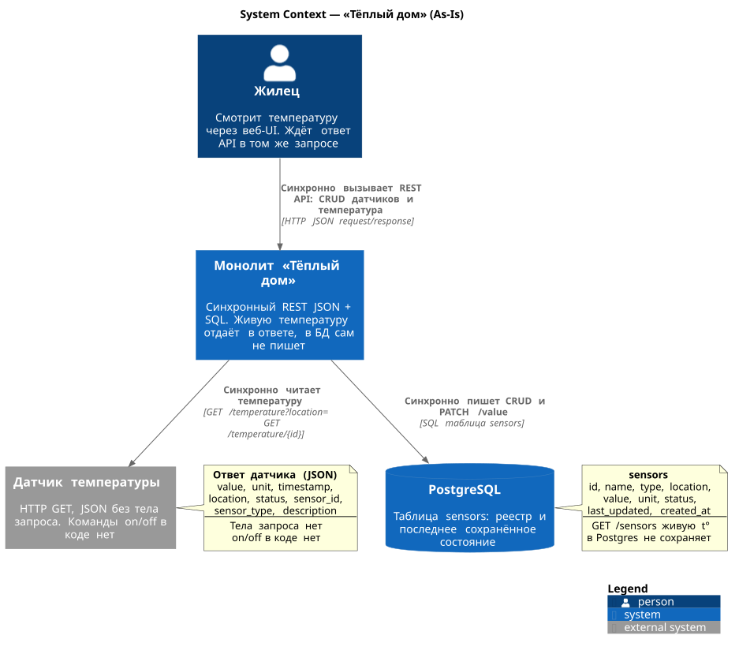

```plantuml
@startuml
!include https://raw.githubusercontent.com/plantuml-stdlib/C4-PlantUML/master/C4_Context.puml
!include https://raw.githubusercontent.com/plantuml-stdlib/C4-PlantUML/master/C4_Container.puml

title System Context — «Тёплый дом» (As-Is)

Person(user, "Жилец", "Смотрит температуру через веб-UI. Ждёт ответ API в том же запросе")

System(monolith, "Монолит «Тёплый дом»", "Синхронный REST JSON + SQL. Живую температуру отдаёт в ответе, в БД сам не пишет")

System_Ext(device, "Датчик температуры", "HTTP GET, JSON без тела запроса. Команды on/off в коде нет")

SystemDb(postgres, "PostgreSQL", "Таблица sensors: реестр и последнее сохранённое состояние")

Rel(user, monolith, "Синхронно вызывает REST API: CRUD датчиков и температура", "HTTP JSON request/response")
Rel(monolith, device, "Синхронно читает температуру", "GET /temperature?location=  GET /temperature/{id}")
Rel(monolith, postgres, "Синхронно пишет CRUD и PATCH /value", "SQL таблица sensors")

note right of device
  **Ответ датчика (JSON)**
  value, unit, timestamp,
  location, status, sensor_id,
  sensor_type, description
  ----
  Тела запроса нет
  on/off в коде нет
end note

note right of postgres
  **sensors**
  id, name, type, location,
  value, unit, status,
  last_updated, created_at
  ----
  GET /sensors живую t°
  в Postgres не сохраняет
end note

SHOW_LEGEND()
@enduml
```

PostgreSQL на Context показан как единственное хранилище монолита (так проще сверить схему с кейсом). В каноне C4 база обычно уходит на диаграмму контейнеров — там она появится в задании 2.

# Задание 2. Проектирование микросервисной архитектуры

To-Be по доменам задания 1. Свет, ворота, камера и неизвестный датчик — это `DeviceType`, не отдельные сервисы. Своя Postgres на сервис. Связи читаются со схем.

| Домен (As-Is) | To-Be | Сервис |
| --- | --- | --- |
| Пользователь / дом | SaaS, self-service, несколько домов | `user-house` |
| Управление устройствами | реестр, типы, партнёры, комплекты | `device` |
| Отопление | команда любому типу: heat / light / gate / … | `command` |
| Телеметрия | показания и история | `telemetry` |
| — | сценарии «если температура → команда» | `scenario` |

Как сервисы говорят друг с другом — [ADR-006](docs/adr/0006-sync-http-and-broker.md): синхронный HTTP JSON (не gRPC), брокер — только показание → сценарий. Кто жилец и можно ли ему — [ADR-007](docs/adr/0007-auth-at-gateway.md): токен выдаёт `user-house`, пускает Gateway. Чужую БД не читаем ([ADR-004](docs/adr/0004-db-per-service.md)). Свет и ворота не сервисы ([ADR-005](docs/adr/0005-device-type-not-service.md)).

SVG собирает [GitHub Actions](.github/workflows/plantuml.yml).

**Диаграмма контейнеров (Containers)**

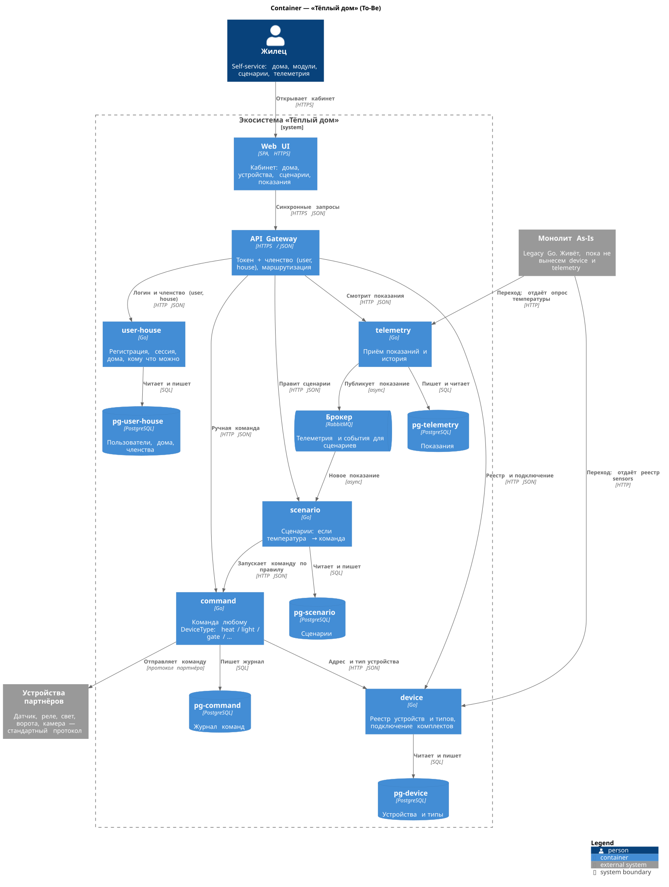

Исходник: [docs/c4/02-container-to-be.puml](docs/c4/02-container-to-be.puml)

```plantuml
@startuml
!include https://raw.githubusercontent.com/plantuml-stdlib/C4-PlantUML/master/C4_Container.puml

title Container — «Тёплый дом» (To-Be)

Person(user, "Жилец", "Self-service: дома, модули, сценарии, телеметрия")

System_Boundary(eco, "Экосистема «Тёплый дом»") {
    Container(web, "Web UI", "SPA, HTTPS", "Кабинет: дома, устройства, сценарии, показания")
    Container(gw, "API Gateway", "HTTPS / JSON", "Вход жильца: проверяет токен, маршрутизация")

    Container(userHouse, "user-house", "Go", "Регистрация, сессия, дома, кому что можно")
    Container(device, "device", "Go", "Реестр устройств и типов, подключение комплектов")
    Container(command, "command", "Go", "Команда любому DeviceType: heat / light / gate / …")
    Container(telemetry, "telemetry", "Go", "Приём показаний и история")
    Container(scenario, "scenario", "Go", "Сценарии: если температура → команда")

    ContainerDb(dbUser, "pg-user-house", "PostgreSQL", "Пользователи и дома")
    ContainerDb(dbDevice, "pg-device", "PostgreSQL", "Устройства и типы")
    ContainerDb(dbCommand, "pg-command", "PostgreSQL", "Журнал команд")
    ContainerDb(dbTel, "pg-telemetry", "PostgreSQL", "Показания")
    ContainerDb(dbSc, "pg-scenario", "PostgreSQL", "Сценарии")

    ContainerQueue(broker, "Брокер", "Kafka / RabbitMQ", "Телеметрия и события для сценариев")
}

System_Ext(monolith, "Монолит As-Is", "Legacy Go. Живёт, пока не вынесем device и telemetry")
System_Ext(partner, "Устройства партнёров", "Датчик, реле, свет, ворота, камера — стандартный протокол")

Rel(user, web, "Открывает кабинет", "HTTPS")
Rel(web, gw, "Синхронные запросы", "HTTPS JSON")

Rel(gw, userHouse, "Логин и проверка токена", "HTTP JSON")
Rel(gw, device, "Реестр и подключение", "HTTP JSON")
Rel(gw, command, "Ручная команда", "HTTP JSON")
Rel(gw, telemetry, "Смотрит показания", "HTTP JSON")
Rel(gw, scenario, "Правит сценарии", "HTTP JSON")

Rel(userHouse, dbUser, "Читает и пишет", "SQL")
Rel(device, dbDevice, "Читает и пишет", "SQL")
Rel(command, dbCommand, "Пишет журнал", "SQL")
Rel(telemetry, dbTel, "Пишет и читает", "SQL")
Rel(scenario, dbSc, "Читает и пишет", "SQL")

Rel(command, device, "Адрес и тип устройства", "HTTP JSON")
Rel(command, partner, "Отправляет команду", "протокол партнёра")
Rel(telemetry, broker, "Публикует показание", "async")
Rel(broker, scenario, "Новое показание", "async")
Rel(scenario, command, "Запускает команду по правилу", "HTTP JSON")

Rel(monolith, device, "Переход: отдаёт реестр sensors", "HTTP")
Rel(monolith, telemetry, "Переход: отдаёт опрос температуры", "HTTP")

SHOW_LEGEND()
@enduml
```

**Диаграмма компонентов (Components)**

По одному Component на каждый сервис. Жилец в сервисы не ходит напрямую: Gateway уже проверил токен.

`user-house` — кто пользователь и какие у него дома.

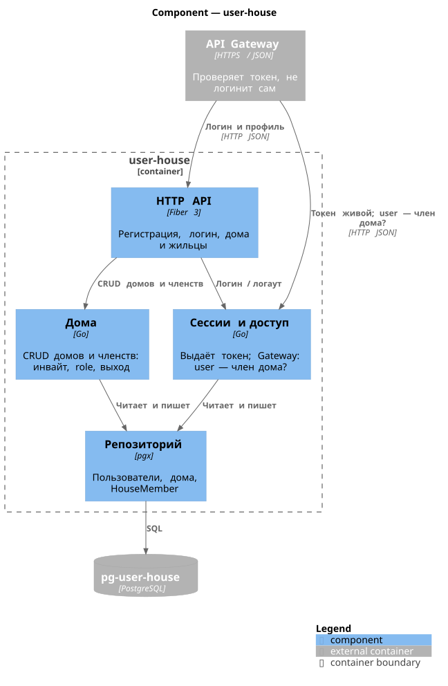

Исходник: [docs/c4/02-component-user-house.puml](docs/c4/02-component-user-house.puml)

```plantuml
@startuml
!include https://raw.githubusercontent.com/plantuml-stdlib/C4-PlantUML/master/C4_Component.puml

title Component — user-house

Container_Boundary(userHouse, "user-house") {
    Component(api, "HTTP API", "Gin", "Регистрация, логин, дома, кто владелец")
    Component(auth, "Сессии и доступ", "Go", "Выдаёт токен, отвечает Gateway: этот жилец существует")
    Component(houses, "Дома", "Go", "Список домов пользователя, self-service")
    Component(repo, "Репозиторий", "pgx", "Пользователи, токены, дома")
}

ContainerDb_Ext(db, "pg-user-house", "PostgreSQL")
Container_Ext(gw, "API Gateway", "HTTPS / JSON", "Проверяет токен, не логинит сам")

Rel(gw, api, "Логин и профиль", "HTTP JSON")
Rel(gw, auth, "Токен живой, какой user_id", "HTTP JSON")
Rel(api, auth, "Логин / логаут")
Rel(api, houses, "CRUD домов")
Rel(auth, repo, "Читает и пишет")
Rel(houses, repo, "Читает и пишет")
Rel(repo, db, "SQL")

SHOW_LEGEND()
@enduml
```

`device` — API, менеджер состояния, обработчик подключения (как в курсе).

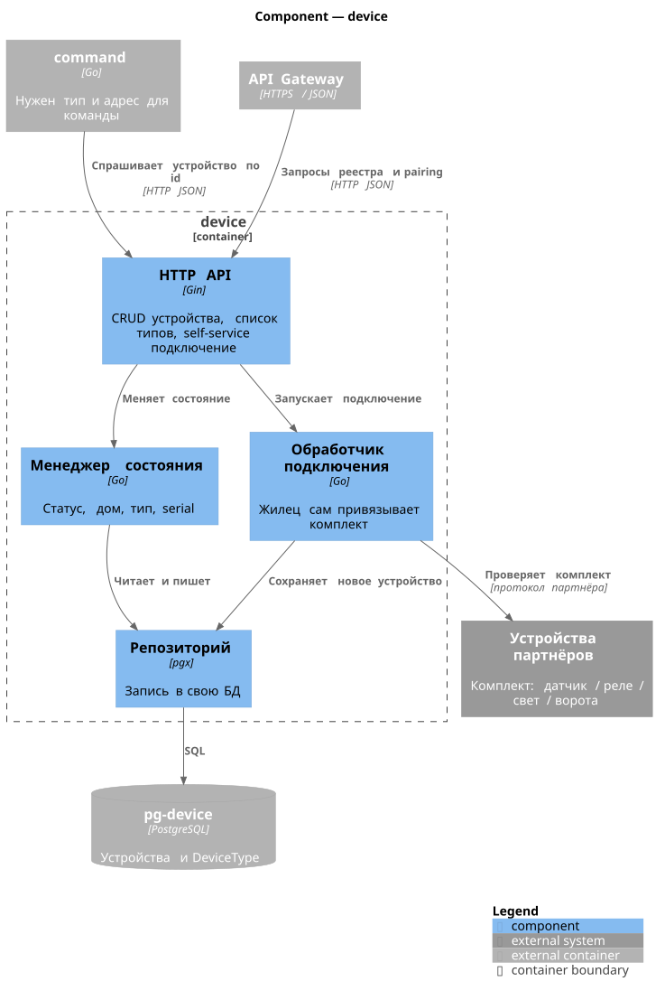

Исходник: [docs/c4/02-component-device.puml](docs/c4/02-component-device.puml)

```plantuml
@startuml
!include https://raw.githubusercontent.com/plantuml-stdlib/C4-PlantUML/master/C4_Component.puml

title Component — device

Container_Boundary(device, "device") {
    Component(api, "HTTP API", "Gin", "CRUD устройства, список типов, self-service подключение")
    Component(registry, "Менеджер состояния", "Go", "Статус, дом, тип, serial")
    Component(pairing, "Обработчик подключения", "Go", "Жилец сам привязывает комплект")
    Component(repo, "Репозиторий", "pgx", "Запись в свою БД")
}

ContainerDb_Ext(db, "pg-device", "PostgreSQL", "Устройства и DeviceType")
Container_Ext(command, "command", "Go", "Нужен тип и адрес для команды")
Container_Ext(gw, "API Gateway", "HTTPS / JSON")
System_Ext(partner, "Устройства партнёров", "Комплект: датчик / реле / свет / ворота")

Rel(gw, api, "Запросы реестра и pairing", "HTTP JSON")
Rel(api, registry, "Меняет состояние")
Rel(api, pairing, "Запускает подключение")
Rel(registry, repo, "Читает и пишет")
Rel(pairing, repo, "Сохраняет новое устройство")
Rel(pairing, partner, "Проверяет комплект", "протокол партнёра")
Rel(repo, db, "SQL")
Rel(command, api, "Спрашивает устройство по id", "HTTP JSON")

SHOW_LEGEND()
@enduml
```

`telemetry` — приём, валидация, история, событие в брокер.

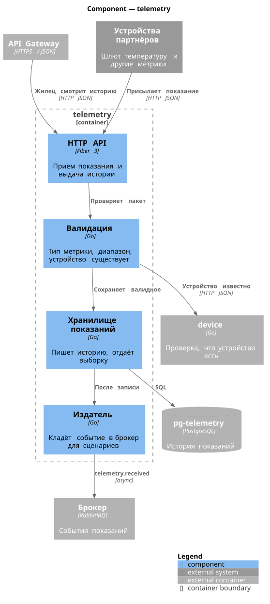

Исходник: [docs/c4/02-component-telemetry.puml](docs/c4/02-component-telemetry.puml)

```plantuml
@startuml
!include https://raw.githubusercontent.com/plantuml-stdlib/C4-PlantUML/master/C4_Component.puml

title Component — telemetry

Container_Boundary(telemetry, "telemetry") {
    Component(api, "HTTP API", "Gin", "Приём показания и выдача истории")
    Component(validate, "Валидация", "Go", "Тип метрики, диапазон, устройство существует")
    Component(store, "Хранилище показаний", "Go", "Пишет историю, отдаёт выборку")
    Component(pub, "Издатель", "Go", "Кладёт событие в брокер для сценариев")
}

ContainerDb_Ext(db, "pg-telemetry", "PostgreSQL", "История показаний")
Container_Ext(broker, "Брокер", "Kafka / RabbitMQ", "События показаний")
Container_Ext(gw, "API Gateway", "HTTPS / JSON")
Container_Ext(device, "device", "Go", "Проверка, что устройство есть")
System_Ext(partner, "Устройства партнёров", "Шлют температуру и другие метрики")

Rel(gw, api, "Жилец смотрит историю", "HTTP JSON")
Rel(partner, api, "Присылает показание", "HTTP JSON")
Rel(api, validate, "Проверяет пакет")
Rel(validate, device, "Устройство известно", "HTTP JSON")
Rel(validate, store, "Сохраняет валидное")
Rel(store, db, "SQL")
Rel(store, pub, "После записи")
Rel(pub, broker, "telemetry.received", "async")

SHOW_LEGEND()
@enduml
```

`command` — ручная команда и вызов сценария, проверка дома, адаптер партнёра.

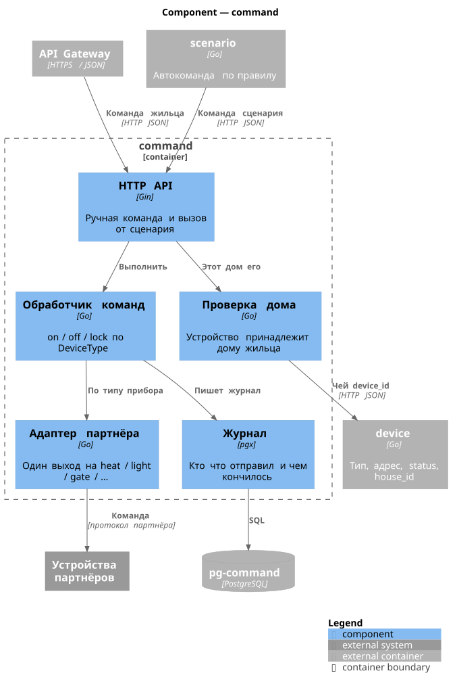

Исходник: [docs/c4/02-component-command.puml](docs/c4/02-component-command.puml)

```plantuml
@startuml
!include https://raw.githubusercontent.com/plantuml-stdlib/C4-PlantUML/master/C4_Component.puml

title Component — command

Container_Boundary(command, "command") {
    Component(api, "HTTP API", "Gin", "Ручная команда и вызов от сценария")
    Component(handler, "Обработчик команд", "Go", "on / off / lock по DeviceType")
    Component(acl, "Проверка дома", "Go", "Устройство принадлежит дому жильца")
    Component(adapter, "Адаптер партнёра", "Go", "Один выход на heat / light / gate / …")
    Component(repo, "Журнал", "pgx", "Кто что отправил и чем кончилось")
}

ContainerDb_Ext(db, "pg-command", "PostgreSQL")
Container_Ext(gw, "API Gateway", "HTTPS / JSON")
Container_Ext(device, "device", "Go", "Тип, адрес, status, house_id")
Container_Ext(scenario, "scenario", "Go", "Автокоманда по правилу")
System_Ext(partner, "Устройства партнёров")

Rel(gw, api, "Команда жильца", "HTTP JSON")
Rel(scenario, api, "Команда сценария", "HTTP JSON")
Rel(api, acl, "Этот дом его")
Rel(acl, device, "Чей device_id", "HTTP JSON")
Rel(api, handler, "Выполнить")
Rel(handler, adapter, "По типу прибора")
Rel(adapter, partner, "Команда", "протокол партнёра")
Rel(handler, repo, "Пишет журнал")
Rel(repo, db, "SQL")

SHOW_LEGEND()
@enduml
```

`scenario` — правила жильца, подписка на брокер, вызов command.

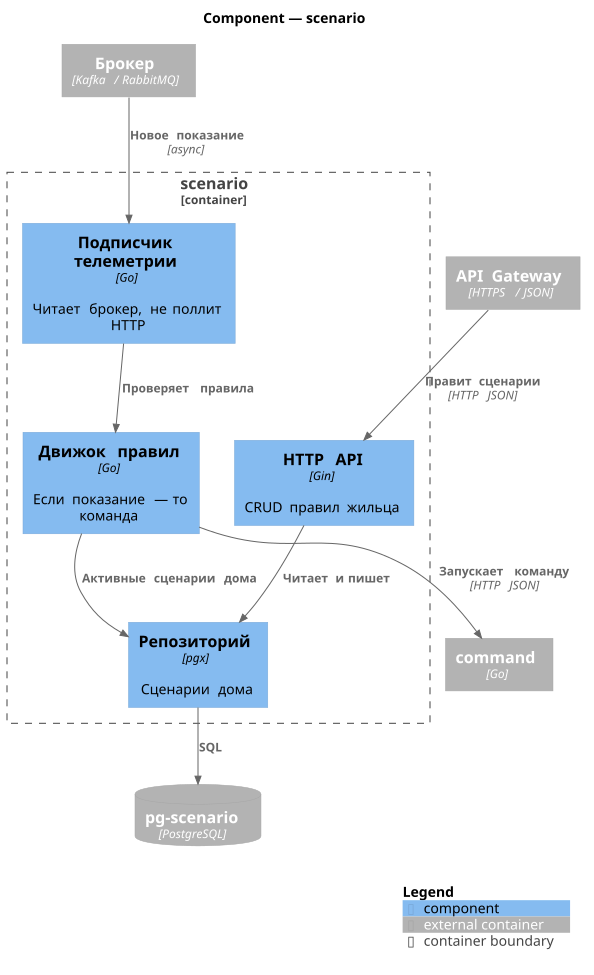

Исходник: [docs/c4/02-component-scenario.puml](docs/c4/02-component-scenario.puml)

```plantuml
@startuml
!include https://raw.githubusercontent.com/plantuml-stdlib/C4-PlantUML/master/C4_Component.puml

title Component — scenario

Container_Boundary(scenario, "scenario") {
    Component(api, "HTTP API", "Gin", "CRUD правил жильца")
    Component(engine, "Движок правил", "Go", "Если показание — то команда")
    Component(consumer, "Подписчик телеметрии", "Go", "Читает брокер, не поллит HTTP")
    Component(repo, "Репозиторий", "pgx", "Сценарии дома")
}

ContainerDb_Ext(db, "pg-scenario", "PostgreSQL")
Container_Ext(gw, "API Gateway", "HTTPS / JSON")
Container_Ext(cmd, "command", "Go")
Container_Ext(broker, "Брокер", "Kafka / RabbitMQ")

Rel(gw, api, "Правит сценарии", "HTTP JSON")
Rel(api, repo, "Читает и пишет")
Rel(repo, db, "SQL")
Rel(broker, consumer, "Новое показание", "async")
Rel(consumer, engine, "Проверяет правила")
Rel(engine, repo, "Активные сценарии дома")
Rel(engine, cmd, "Запускает команду", "HTTP JSON")

SHOW_LEGEND()
@enduml
```

**Диаграмма кода (Code)**

Модель устройства (потом ляжет на ER задания 3) и последовательность команды.

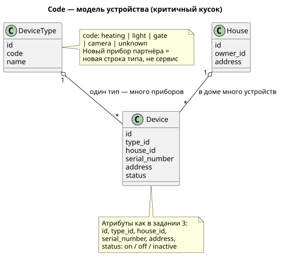

Исходник: [docs/c4/02-code-device-class.puml](docs/c4/02-code-device-class.puml)

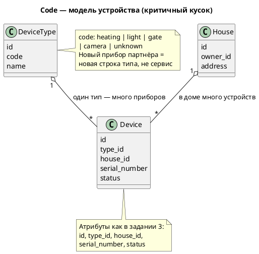

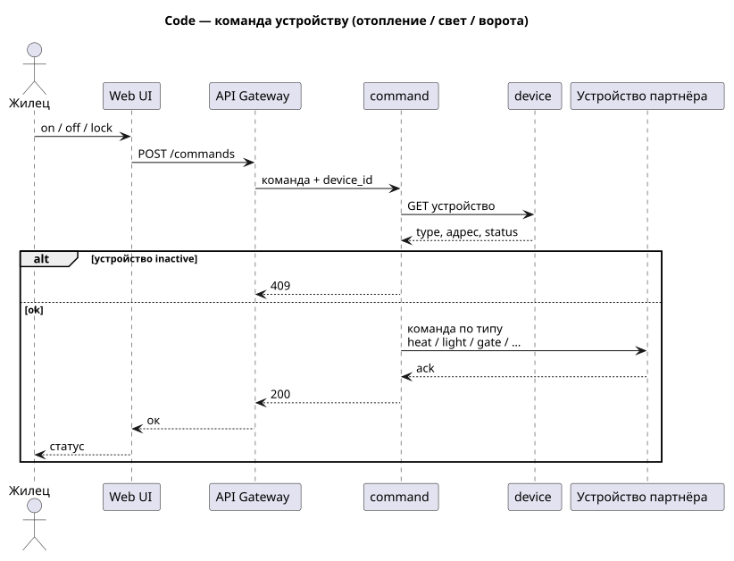

Исходник: [docs/c4/02-code-command-sequence.puml](docs/c4/02-code-command-sequence.puml)

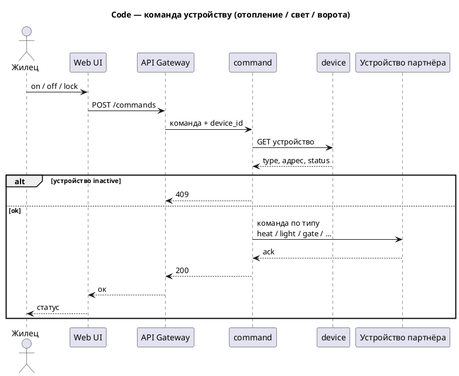


# Задание 3. Разработка ER-диаграммы

Логическая модель To-Be. Сущности режем по тем же сервисам, что в задании 2. Своя Postgres на сервис ([ADR-004](docs/adr/0004-db-per-service.md)): внутри пакета — обычный FK, между пакетами — только `id` (ref), JOIN чужой таблицы нет.

`Module` — комплект, который жилец сам выбирает для дома (отопление, свет, ворота). `Device` — конкретный прибор с серийником. Связи Module — Device нет: оба смотрят на дом и тип. `DeviceType` — справочник видов; свет и ворота не отдельные таблицы и не сервисы ([ADR-005](docs/adr/0005-device-type-not-service.md)).

Как в задании: один жилец — много домов, у дома один владелец (`owner_id`).

| Сущность | Сервис / БД | Атрибуты | Зачем |
| --- | --- | --- | --- |
| `User` | `user-house` | `id`, `email`, `created_at` | кто жилец |
| `House` | `user-house` | `id`, `owner_id`, `address`, `name` | дом, один владелец |
| `DeviceType` | `device` | `id`, `code`, `name` | heating / light / gate / camera / unknown |
| `Module` | `device` | `id`, `house_id`, `type_id`, `name`, `status` | выбранный комплект в доме |
| `Device` | `device` | `id`, `type_id`, `house_id`, `serial_number`, `status` | прибор в доме |
| `TelemetryData` | `telemetry` | `id`, `device_id`, `value`, `unit`, `recorded_at` | история показаний |
| `Scenario` | `scenario` | `id`, `house_id`, `name`, `condition`, `action`, `enabled` | если показание → команда |
| `Command` | `command` | `id`, `device_id`, `action`, `source`, `result`, `created_at` | журнал on / off / lock |

| Связь | Тип | Смысл |
| --- | --- | --- |
| User — House | 1 : N | один жилец — много домов; у дома один владелец |
| House — Module | 1 : N | в доме несколько комплектов |
| DeviceType — Module | 1 : N | один тип — много комплектов |
| House — Device | 1 : N | в доме несколько устройств |
| DeviceType — Device | 1 : N | один тип — много приборов |
| Device — TelemetryData | 1 : N | одно устройство — много показаний |
| House — Scenario | 1 : N | у дома несколько сценариев |
| Device — Command | 1 : N | одно устройство — много команд |

SVG собирает [GitHub Actions](.github/workflows/plantuml.yml).

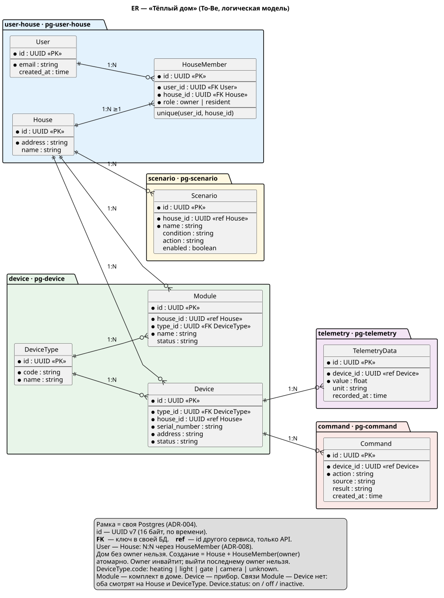

Исходник: [docs/c4/03-er-to-be.puml](docs/c4/03-er-to-be.puml)

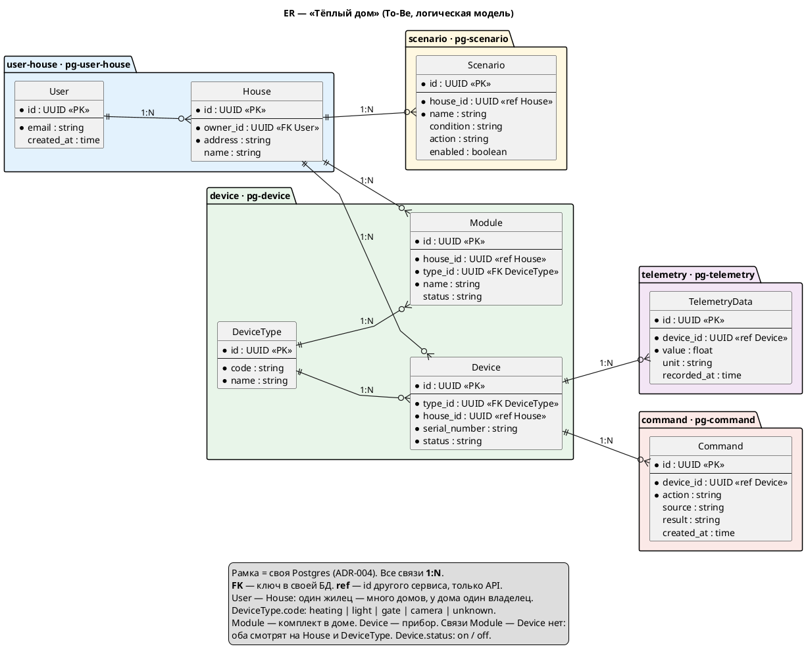

# Задание 4. Создание и документирование API

### 1. Тип API

Укажите, какой тип API вы будете использовать для взаимодействия микросервисов. Объясните своё решение.

### 2. Документация API

Здесь приложите ссылки на документацию API для микросервисов, которые вы спроектировали в первой части проектной работы. Для документирования используйте Swagger/OpenAPI или AsyncAPI.

# Задание 5. Работа с docker и docker-compose

Перейдите в apps.

Там находится приложение-монолит для работы с датчиками температуры. В README.md описано как запустить решение.

Вам нужно:

1) сделать простое приложение temperature-api на любом удобном для вас языке программирования, которое при запросе /temperature?location= будет отдавать рандомное значение температуры.

Locations - название комнаты, sensorId - идентификатор названия комнаты

```
	// If no location is provided, use a default based on sensor ID
	if location == "" {
		switch sensorID {
		case "1":
			location = "Living Room"
		case "2":
			location = "Bedroom"
		case "3":
			location = "Kitchen"
		default:
			location = "Unknown"
		}
	}

	// If no sensor ID is provided, generate one based on location
	if sensorID == "" {
		switch location {
		case "Living Room":
			sensorID = "1"
		case "Bedroom":
			sensorID = "2"
		case "Kitchen":
			sensorID = "3"
		default:
			sensorID = "0"
		}
	}
```

2) Приложение следует упаковать в Docker и добавить в docker-compose. Порт по умолчанию должен быть 8081

3) Кроме того для smart_home приложения требуется база данных - добавьте в docker-compose файл настройки для запуска postgres с указанием скрипта инициализации ./smart_home/init.sql

Для проверки можно использовать Postman коллекцию smarthome-api.postman_collection.json и вызвать:

- Create Sensor
- Get All Sensors

Должно при каждом вызове отображаться разное значение температуры

Ревьюер будет проверять точно так же.


# **Задание 6. Разработка MVP**

Необходимо создать новые микросервисы и обеспечить их интеграции с существующим монолитом для плавного перехода к микросервисной архитектуре. 

### **Что нужно сделать**

1. Создайте новые микросервисы для управления телеметрией и устройствами (с простейшей логикой), которые будут интегрированы с существующим монолитным приложением. Каждый микросервис на своем ООП языке.
2. Обеспечьте взаимодействие между микросервисами и монолитом (при желании с помощью брокера сообщений), чтобы постепенно перенести функциональность из монолита в микросервисы. 

В результате у вас должны быть созданы Dockerfiles и docker-compose для запуска микросервисов. 